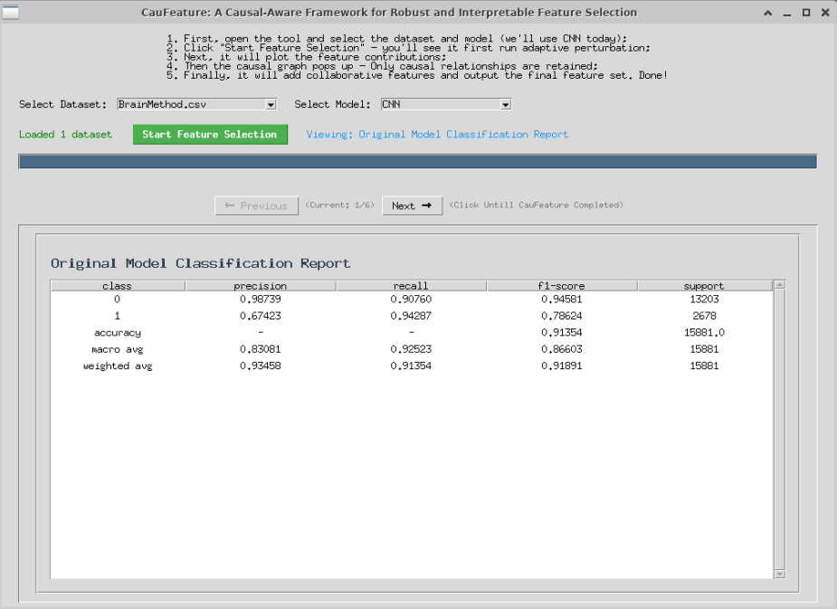
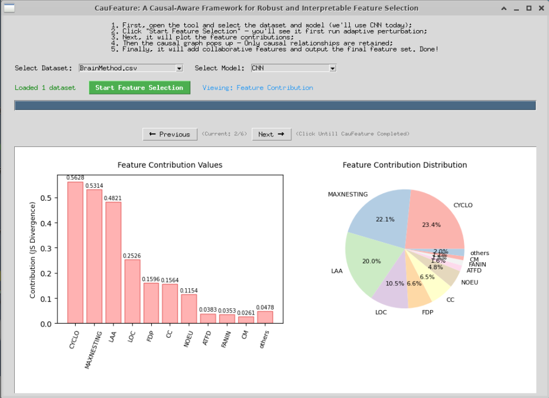
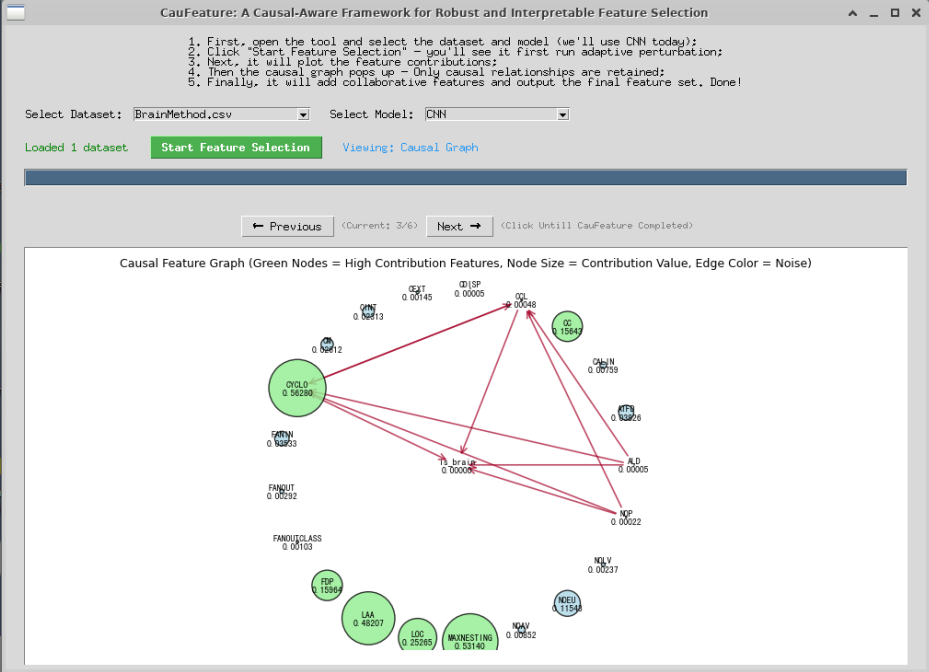
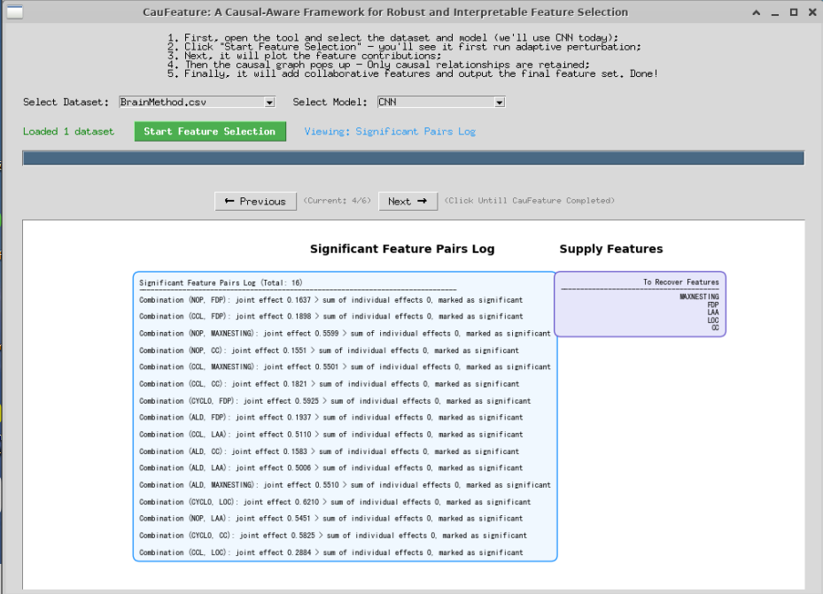
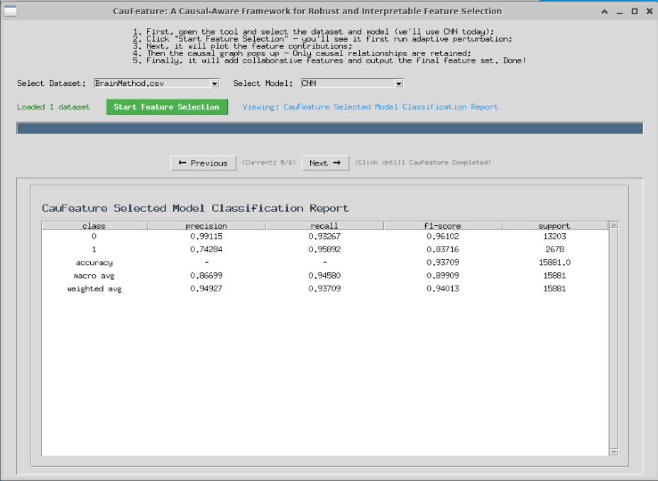

# A Causal-Aware Framework for Robust and Interpretable Feature Selection

## Overview

CauFeature is a framework designed for robust and interpretable feature selection using causal-aware methods. It provides a graphical user interface (GUI) to visualize and execute the entire feature selection workflow, including model training, feature perturbation, causal graph construction, and redundant feature recovery.

## Quick Start

### Prerequisites

Install required dependencies:

bash

```bash
pip install -r requirements.txt
```

### Run the Demonstration

The main entry point is `a_demonstration.py`, which launches the GUI interface:

bash

```bash
python a_demonstration.py
```

## Workflow

1. **Launch the Tool**: Run `a_demonstration.py` to open the GUI.
2. **Select Dataset and Model**: Choose a dataset from the available options (loaded from `/root/tmp/causalFeatureX_LSTM_1003/dataset1`) and select the model (currently supports CNN).
3. **Start Feature Selection**: Click "Start Feature Selection" to initiate the process:
   * **Step 1**: Initial model training (adaptive CNN model based on data characteristics).

     
   * **Step 2**: Adaptive feature perturbation to calculate feature contributions.

     
   * **Step 3**: Construction and display of causal graph (retaining only causal relationships).

     
   * **Step 4**:Identification and recovery of redundant features.

     
   * **Step 5**: Output of the final feature set.

     

     

## Key Components

* `a_demonstration.py`: Main GUI interface, orchestrates the entire workflow.
* `model_train_v6.py`: Dynamically builds and trains 1D CNN models based on feature dimensions and sample size.
* `feature_perturbation_v7_english.py`: Performs feature perturbation experiments to calculate feature contributions using JS divergence.
* `causal_graph_build_v19_english.py`: Constructs causal graphs based on feature contributions and statistical relationships.
* `redundantRecover_v10_english.py`: Identifies and recovers redundant features to improve feature set completeness.

## Notes

* Ensure the dataset directory (`/root/tmp/causalFeatureX_LSTM_1003/dataset1`) contains valid datasets.
* GPU memory is configured to grow dynamically to avoid excessive initial memory allocation.
* TensorFlow logs are set to ERROR level to reduce verbosity.# CauFeature
